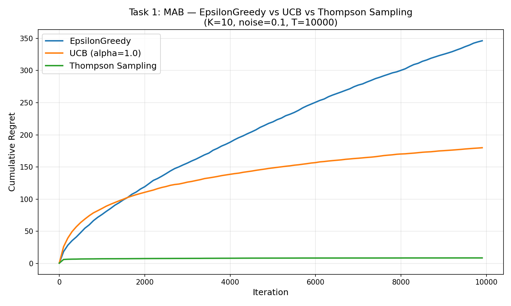
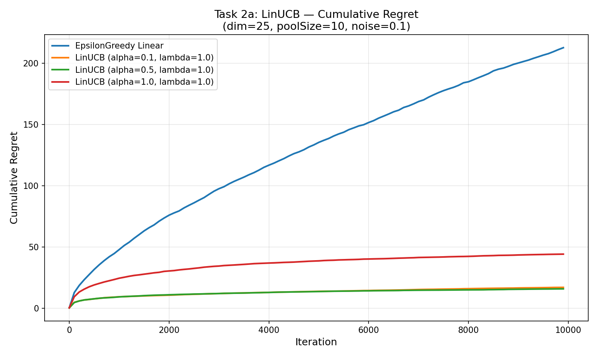

# Foundations of Online Machine Learning

Coursework and exploratory research from my studies at **Oregon State University**. This repository documents how I worked through the foundations of online learning: making decisions with incomplete information, balancing exploration and exploitation, evaluating regret, and studying where familiar learning rules can fail in multiclass settings.

The repository is a collection of assignments, experiments, reports, and presentations rather than a single software package.

## What I worked on

| Area | Work in this repository |
| --- | --- |
| Multi-armed bandits | Implementations and simulations of explore-then-commit, ε-greedy, UCB, and Thompson sampling. |
| Linear bandits | Implementations of linear ε-greedy, LinUCB, and linear Thompson sampling using article feature vectors and user preferences. |
| Evaluation | Simulated sequential decisions, compared cumulative regret, examined parameter estimation error, and generated plots of algorithm behavior. |
| Multiclass learning | An experimental project on local regularization, empirical risk minimization (ERM), and a Default-Star learner for the H△ hypothesis class. |

## Bandit simulations

The homework simulation models a sequence of article recommendations. Each algorithm selects an article, observes a reward, updates its estimates, and repeats. The experiments compare its choices with the best available choice to track **regret** over time. The linear setting also measures how closely the learned user-preference vector matches the simulated ground truth.

Start with [`RunAll.py`](RunAll.py) for the combined simulation, [`lib/`](lib/) for the algorithm implementations, and [`SimulationResults/`](SimulationResults/) for saved plots. [`CODE_EXPLANATION.md`](CODE_EXPLANATION.md) walks through the bandit code and its exploration–exploitation tradeoffs.

Example results:

| Multi-armed bandits | Linear bandits |
| --- | --- |
|  |  |

To run the simulations locally:

```bash
python -m pip install numpy matplotlib
python RunAll.py
```

The script writes plots to `SimulationResults/`. The simulations may take time depending on the configured number of iterations.

## Local regularization project

My separate project investigates a question in multiclass learning: **can local regularization learn every learnable multiclass problem?** I explored the H△ construction and compared ERM, a Default-Star learner, and selected local-regularization strategies in simulations.

The project source and its own instructions are packaged in [`local_regularization_project.zip`](local_regularization_project.zip). The repository also includes the [project report](Final_Report.pdf), [LaTeX report source](Project_Report.tex), [presentation](Local_Regularization_Multiclass_Presentation.pptx), and experiment figures such as [`exp5_summary.png`](exp5_summary.png).

These experiments illustrate behavior for the implementations and settings tested. They **do not resolve the general open question** about every possible local regularizer.

## Repository guide

- [`lib/`](lib/) — bandit algorithm implementations.
- [`RunAll.py`](RunAll.py), [`SimulationMAB.py`](SimulationMAB.py), [`SimulationLinear.py`](SimulationLinear.py) — simulation entry points.
- [`SimulationResults/`](SimulationResults/) — generated bandit plots.
- [`Homework 1.pdf`](Homework%201.pdf), [`Homework 3.pdf`](Homework%203.pdf), [`ONLINE_ML_HW_4.pdf`](ONLINE_ML_HW_4.pdf) — course assignment material.
- [`local_regularization_project.zip`](local_regularization_project.zip) — self-contained multiclass learning experiment.
- [`Final_Report.pdf`](Final_Report.pdf) and [`ONLINE_ML_FINAL_PROJECT.pdf`](ONLINE_ML_FINAL_PROJECT.pdf) — project documentation.

## What I learned

Implementing these algorithms made the exploration–exploitation tradeoff concrete: decisions that seem best from current data can prevent an algorithm from learning about better options. Comparing regret curves and preference estimates helped me connect the mathematical objectives of online learning with actual algorithm behavior. The multiclass project gave me practice reading research, translating theoretical constructions into experiments, and being careful about the limits of empirical evidence.

## Final project: testing a possible limit of local regularization

For my final project, I explored an open question from multiclass learning theory: **can a local regularizer learn every learnable multiclass hypothesis class?** I focused on the H△ construction discussed by Asilis and collaborators, which offers a way to investigate where local regularization might struggle.

I built a Python simulation with a finite version of the construction, compared ERM and several local-regularization choices against a Default-Star learner, and plotted error under different sample sizes and settings. In my experiments, the local-regularization strategies I tested did not match the Default-Star learner. The work helped me connect a theoretical symmetry argument to concrete learner behavior and to examine what the training sample reveals at unseen points.

**Where I stopped:** I did not prove that *every* possible local regularizer fails. My tests cover selected strategies in a finite simulation, and the experimental setup simplifies parts of the theoretical construction. A general answer would require a rigorous argument over all eligible strategies, beyond these plots. I documented the implementation and findings in the [final report](Final_Report.pdf) and included the [project code](local_regularization_project.zip) so the approach can be inspected and extended.

**Author:** [MILO22U](https://github.com/MILO22U) · Oregon State University coursework and independent exploration
